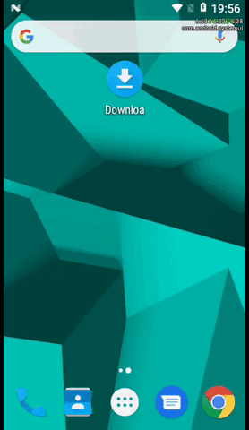

# espresso-onautoscrolledtoview
### An Espresso ViewInteraction for finding views that do not exist
[](https://circleci.com/gh/stoyicker/espresso-onautoscrolledtoview)
## Usage
[  ](https://search.maven.org/search?q=g:com.github.stoyicker.espresso-onautoscrolledtoview)
```groovy
repositories {
  jcenter()
}
dependencies {
  androidTestImplementation "com.github.stoyicker.espresso-onautoscrolledtoview:library:<version>"
}
```

## Which problem does this solve?
A fairly common issue during Android instrumented tests is failing to find a View. Sometimes, this 
is because the View just isn't there due to logic or tests being incorrect, for example. But another
scenario is that the View is only lazily created and it happens to be beyond the viewport on some 
devices. This can happen when, for example, you need to locate an element in a RecyclerView. You may
use something like [RecyclerViewActions.scrollToPosition()](https://developer.android.com/reference/androidx/test/espresso/contrib/RecyclerViewActions),
which will work, but can become extremely inconvenient if the content in the RecyclerView changes
often, such as for example when using Airbnb's Epoxy, since you'll have to manually maintain the
indexes.

To address that, this tool provides the capability of specifying the View that needs to be located
not with an index, but with a regular Hamcrest `Matcher<View>`, exactly the same way as regular
`Espresso.onView(Matcher<View>)` works. In fact, this is how this tool works too: it uses your own
matcher to evaluate your matcher against the viewport: if the evaluation fails, it simulates a 
finger swipe gesture with the hopes of it resulting in a different viewport, and then repeats 
(or times out); if the evaluations succeeds, it returns `Espresso.onView(Matcher<View>)` with your 
matcher.

## What does it look like?


## How do I use it?
There is one method that is your entry point to interacting with this library:

```java
package onautoscrolledtoview;

public final class OnAutoScrolledToView {
  public static void onAutoScrolledToView(Matcher<View>, Options)
}
```

The first parameter is the matcher that describes a
condition to use to find your view, and the second one carries configuration that you may use to
customize the scrolling behavior.

You may use `Options.builder()` to get an instance. See [Options](library/src/main/java/onautoscrolledtoview/OnAutoScrolledToView.java#L23)
for documentation and defaults that are used for each field if unset (or when using 
`onAutoScrolledToView(Matcher<View>)`, the `Options`-less overload instead).

After the method returns, all you get is the same as when you invoke `onView(Matcher<View>)` 
and it returns successfully, so you may continue to use it as such:

```java
onAutoScrolledToView(withId(R.id.your_id)).check(matches(isDisplayed()));
```

See [the instrumented tests in demo](demo/src/androidTest/java/onautoscrolledtoview/demo) for more
examples.

### Compatibility
This library requires API 17. It is implicitly __compatible with both LTR and RTL layouts, as well 
as any type of view__.

## Versioning
Stable versions of this tool follow espresso-core's versioning. Therefore, every released version is
guaranteed to work with the same version of espresso-core. Use with other versions at your own risk.
